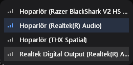
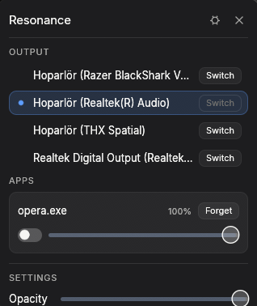

# Resonance

[English](README.md) | [Türkçe](README.tr.md)

Her uygulamanın ses seviyesini ve sessize alma durumunu her ses çıkış
cihazına göre ayrı ayrı hatırlayan ve varsayılan cihaz her değiştiğinde
bunu otomatik olarak geri yükleyen hafif bir Windows arka plan aracı.

WASAPI, çalışan bir uygulamanın oturum ses seviyesini oluşturulduğu fiziksel
çıkışa bağlı tutar; siz kulaklıktan hoparlöre geçtiğinizde Windows'un
kendisi bunu geri yüklemek için hiçbir şey yapmaz. Resonance canlı ses
oturumlarını izler, cihaz başına yaptığınız ses/sessize alma
değişikliklerini kaydeder ve bir oturum belirdiği ya da varsayılan cihaz
değiştiği anda doğru değerleri yeniden uygular — bunu küçük, her zaman üstte
duran bir overlay, bir tepsi ikonu ve genel bir klavye kısayoluyla
(varsayılan olarak `Ctrl+Alt+V`, overlay'in ayarlar panelinden
değiştirilebilir) sunar.

## Gereksinimler

- Windows 10 veya üzeri, 64-bit.
- Kurulum gerektirmez; tek bir çalıştırılabilir dosya (`resonance-app.exe`).

## Kullanım

`resonance-app.exe --overlay` komutunu çalıştırın. Varsayılan olarak
ekranın sağ-alt köşesinde küçük bir ikon durur:

Üzerine gelmeniz (tıklamaya gerek yok) bağlı cihazları gösterir, birine
tıklayarak doğrudan o cihaza geçebilirsiniz:

İkonun kendisine tıklamak (ya da genel kısayolu kullanmak, ya da tepsi
ikonunu kullanmak) tam overlay'i açar; burada bir cihaz sekmesi seçip
uygulama başına girdileri ayarlayabilir veya unutturabilirsiniz — tam
overlay açıkken köşe ikonu kendiliğinden bir kenara çekilir, kapanınca
geri gelir:

İkonu basılı tutup ekranda istediğiniz yere sürükleyebilirsiniz; bu konum
yeniden başlatmalar arasında hatırlanır. Sağ tıklayarak gizleyebilir, tepsi
ikonunun "Show icon" menü öğesinden geri getirebilirsiniz. Ayarlar
panelindeki "Start with Windows" seçeneğini açmak, oturum açılışında
otomatik başlatır.

Arayüz olmadan arka ucu incelemek için iki ek komut satırı modu daha
vardır — `resonance-app --run` ve `resonance-app --dump-events` — ayrıntılar
için `resonance-app --help` komutuna bakın; bunlar geliştirme araçlarıdır,
normal kullanıcı akışının parçası değildir.

## Bilinen sınırlamalar

- **Varsayılan cihaz değiştirme, belgelenmemiş bir Windows arayüzüne
  bağlıdır.** Windows, sistem varsayılan ses çıkışını değiştirmek için hiçbir
  zaman genel bir API sunmadı; bu alandaki her araç (bu araç dahil) Windows
  Ayarlar'ın kendisinin de kullandığı aynı özel `IPolicyConfig` arayüzüne
  dayanır. Resonance bunun çalışıp çalışmadığını başlangıçta kontrol eder ve
  çalışmıyorsa (gelecekteki bir Windows güncellemesi bunu değiştirir veya
  kaldırırsa) yalnızca-profil modunda çalışmaya devam eder: varsayılan
  cihazı *siz* Windows'un kendi arayüzünden değiştirdiğinizde sesleri yine
  otomatik olarak geri yükler, yalnızca cihazı kendi overlay'inden *sizin
  yerinize* değiştiremez.
- **Oturum başına değil, çalıştırılabilir dosya başına tek profil girdisi.**
  Aynı anda birden fazla ses oturumu açan bir uygulama (nadir ama olur) bunların
  hepsi için tek bir kayıtlı ses/sessize alma girdisini paylaşır — Resonance
  kayıtlı bir profil amacıyla aynı programın iki oturumunu birbirinden
  ayıramaz.
- **Korumalı, yükseltilmiş yetkili veya UWP-sanal alanlı process'lere ait
  oturumlar** isimle tanımlanamayabilir (Windows kimlik sorgusunu reddeder).
  Bu durumda Resonance o oturumu geçerli çalıştırma için yine de gösterir ve
  kontrol eder, ama onun için bir profil girdisi kaydetmez — bir process id,
  yeniden başlatmalar arasında kararlı bir kimlik değildir ve pid ile
  kaydetmek er ya da geç aynı id'yi yeniden kullanan ilgisiz bir process'e
  yanlış kayıtlı profili uygulardı.
- **Overlay'in ekrandaki boyutu Windows ekran ölçeklendirmesiyle
  (%100/%125/%150/…) büyümez** — daha yüksek ölçek faktörlerinde büyümek
  yerine sabit bir fiziksel boyutta kalır. Test edilen her ölçekte doğru
  render ediyor; bu bir ölçekleme kusuru değil, bilinçli olarak sabit
  boyutlu bir paneldir.
- **Köşe widget'ı varsayılan olarak sağ-alt köşede başlar**, siz onu zaten
  başka bir yere sürüklemediyseniz — sürüklediyseniz o konumu yeniden
  başlatmalar arasında hatırlar.
- **Tam overlay paneli açıkken tepsi menüsündeki "Show icon" öğesinin
  hiçbir etkisi yoktur.** Panel açık kaldığı sürece widget kendiliğinden
  gizlenir ve panel kapanınca geri gelir, dolayısıyla bu sırada gösterilecek
  ya da gizlenecek bir şey yoktur.
- **Widget'ın cihaz sıraları hepsi aynı ikonu kullanır** — bir kulaklığı bir
  hoparlörden ya da genel bir Windows ses cihazından güvenilir şekilde
  ayırt etmenin bir yolu yok, bu yüzden her sıra bir ikon tahmin etmek
  yerine cihazın gerçek adını gösterir.

## Lisans

Bağımlılıkların ayrı ayrı lisansları için `cargo deny check licenses`
komutuna ya da tüm üçüncü taraf bağımlılık ağacını listeleyen
`Cargo.lock`'a bakın.
