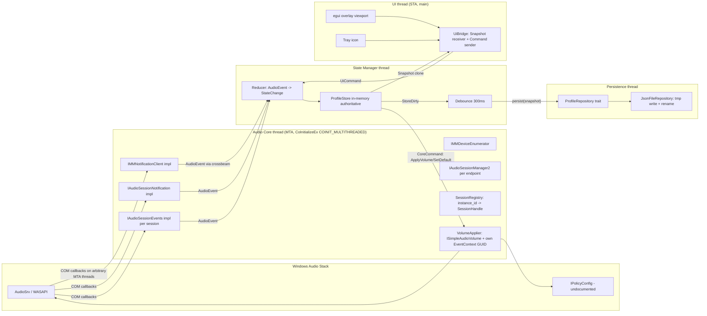

# Resonance — Architecture

Kept current as the implementation progresses. See ADR-0001 (language),
ADR-0003 (UI framework) for the reasoning behind the choices below; further
ADRs are added as later phases make additional architecturally significant
decisions (e.g. the undocumented `IPolicyConfig` API, tracked separately).

## Problem

WASAPI keeps per-application (audio session) volume/mute state attached to
the physical endpoint the session was created on. When the default
playback endpoint changes, Windows does not restore each running
application's volume/mute according to a per-endpoint profile. Resonance
is a lightweight background tool that maintains that profile itself: it
observes live sessions, records user-initiated volume/mute changes per
endpoint, and re-applies the right profile whenever the default endpoint
changes or a new session appears — surfaced through a small always-on-top
overlay.

## Component diagram



## Threads and ownership

| Thread | COM apartment | Owns | Receives | Sends |
|---|---|---|---|---|
| **Audio Core** | MTA | All COM interface pointers, session registry, volume applier, process-wide event-context GUID | `CoreCommand` | `AudioEvent` |
| **COM callback threads** (spawned by AudioSrv) | MTA | Nothing — only a cloned event sender | — | `AudioEvent` (enqueue and return immediately) |
| **State Manager** | none | `ProfileStore`, current default endpoint id, restore logic | `AudioEvent`, `UiCommand` | `CoreCommand`, `Snapshot`, persist requests |
| **Persistence** | none | file handle, last-written hash | persist requests | persist results (logged only) |
| **UI (main)** | STA (winit) | egui context, tray, last `Snapshot` | `Snapshot` | `UiCommand` |

The UI thread is STA because winit initializes COM for drag-and-drop
support (`OleInitialize`). The audio core therefore runs on its own
dedicated thread, explicitly initialized as MTA. No COM interface pointer
is ever passed between these two; the UI only ever sees an owned
`Snapshot` value.

## Crate layout

```
resonance/
├── Cargo.toml                  workspace
├── rust-toolchain.toml
├── crates/
│   ├── resonance-core/         audio core (COM), message types; no UI deps
│   ├── resonance-state/        ProfileStore, reducer, repository; no COM deps
│   ├── resonance-ui/           egui overlay + tray
│   └── resonance-app/          binary: wires threads, single-instance, logging
└── docs/
    ├── ARCHITECTURE.md         this file
    ├── ADR-0001-language.md
    ├── ADR-0002-ipolicyconfig.md   (added when the default-switching phase lands)
    └── ADR-0003-ui-framework.md
```

`resonance-state` must compile and test on any OS, with no dependency on
the `windows` crate, so its state machine can be exercised with pure event
streams independent of the audio backend. This is enforced structurally:
`resonance-core`'s COM-facing code sits behind a Cargo feature
(`com-backend`, default-on), with `windows`/`windows-core` as *optional*
dependencies gated on that feature. `resonance-state` depends on
`resonance-core` with `default-features = false`, so its build never
touches the `windows` crate at all — verified with
`cargo tree -p resonance-state -e normal` showing no `windows`/
`windows-core` entry, while the same command for `resonance-app` (which
needs the real backend) does show them.

## Message types

Single source of truth: `crates/resonance-core/src/messages.rs`.

- `AudioEvent` — emitted by the audio core (endpoint/session changes) and
  consumed by the state manager's reducer.
- `CoreCommand` — issued by the state manager, executed by the audio core
  (apply a session's volume, switch the default endpoint, resync, or shut
  down).
- `UiCommand` — issued by the UI, consumed by the reducer (switch
  endpoint, set a session's volume/mute, forget a saved entry, toggle the
  overlay, quit).
- `Snapshot` — an owned, cheaply-cloneable read model published by the
  state manager after each reducer step; the only thing the UI thread
  ever sees of the rest of the system.

COM callback implementations hold nothing but a cloned event sender (and,
for session events, the session's instance id); they never call a COM
method themselves and never lock anything the audio core thread might
hold — they enqueue an `AudioEvent` and return immediately. All volume
writes issued by the audio core carry a process-wide event-context GUID;
when that GUID comes back on a volume-changed callback, the event is
tagged `own_change: true` so the reducer does not record it as a
user-initiated profile change (preventing feedback loops between writing
a profile and observing our own write).

## Current implementation status

- **Workspace scaffold:** done — four crates, `windows = "=0.62.2"` pinned
  behind `com-backend`, message types defined exactly as above, builds
  clean on `cargo build --workspace`.
- **Audio core (endpoint enumeration):** done. Core thread bootstrap
  (`CoInitializeEx(COINIT_MULTITHREADED)`, RAII teardown), active
  render-endpoint enumeration with id + friendly name, and a registered
  `IMMNotificationClient` all build and pass `cargo clippy -- -D
  warnings` with zero warnings. A temporary `resonance-app --dump-events`
  CLI lists the live endpoint set (cross-checked against the registry —
  matched exactly) and prints device-change events as they arrive.
  Measured core-only RSS (debug build, private working set): 1.08 MB,
  well under the 10 MB budget; a release-build measurement is deferred to
  the hardening phase. Delivery of live `OnDefaultDeviceChanged`/
  `OnDeviceAdded`/`OnDeviceRemoved` notifications from Windows is
  exercised only at the translation-layer level (unit tests driving the
  `_Impl` vtable directly) — end-to-end delivery from a real device
  plug/unplug or default-device change has not yet been observed and
  needs a manual check.
- **Session hooking, default-endpoint switching, state manager,
  persistence, overlay UI:** not started.
