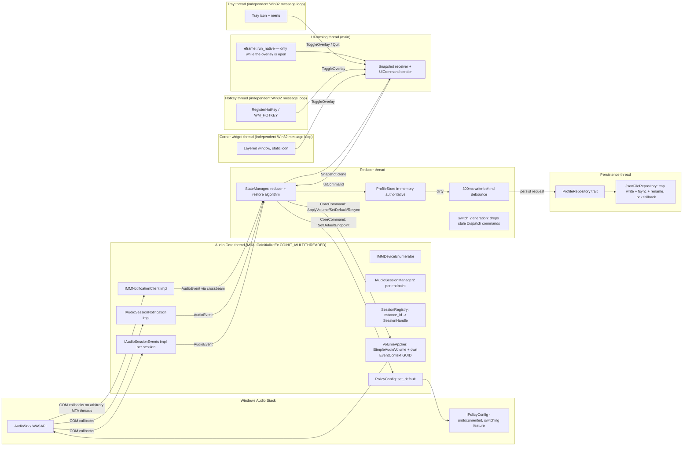

# Resonance — Architecture

Kept current as the implementation progresses. See ADR-0001 (language),
ADR-0002 (the undocumented `IPolicyConfig` API), ADR-0003 (UI framework),
and ADR-0004 (the overlay memory budget) for the reasoning behind the
choices below.

## Problem

WASAPI keeps per-application (audio session) volume/mute state attached to
the physical endpoint the session was created on. When the default
playback endpoint changes, Windows does not restore each running
application's volume/mute according to a per-endpoint profile. Resonance
is a lightweight background tool that maintains that profile itself: it
observes live sessions, records user-initiated volume/mute changes per
endpoint, and re-applies the right profile whenever the default endpoint
changes or a new session appears — surfaced through a small always-on-top
overlay, a tray icon, and a configurable global keyboard shortcut.

## Component diagram



## Threads and ownership

| Thread | COM apartment | Owns | Receives | Sends |
|---|---|---|---|---|
| **Audio Core** | MTA | All COM interface pointers, session registry, volume applier, process-wide event-context GUID, `PolicyConfig` (behind the `switching` feature) | `CoreCommand` | `AudioEvent` |
| **COM callback threads** (spawned by AudioSrv) | MTA | Nothing — only a cloned event sender | — | `AudioEvent` (enqueue and return immediately) |
| **Reducer** | none | `StateManager` (the live `ProfileStore`, restore logic, `switch_generation` counter) | `AudioEvent`, `UiCommand` | `CoreCommand`, `Snapshot`, persist requests |
| **Persistence** | none | file handle, last-written hash, `.bak` rotation | persist requests | persist results (logged only) |
| **UI (main)** | STA (winit, only while `eframe::run_native` is actually running) | egui context, the overlay window itself | `Snapshot` | `UiCommand` |
| **Tray** | STA (its own Win32 message loop) | tray icon, its menu | menu clicks | `UiCommand::ToggleOverlay` / `Quit` (via a signal channel into the UI thread) |
| **Hotkey** | STA (its own Win32 message loop, `RegisterHotKey`/`WM_HOTKEY`) | the registered global shortcut | `WM_HOTKEY` | `UiCommand::ToggleOverlay` (same signal channel) |
| **Corner widget** | STA (its own Win32 message loop) | one layered window, `WS_EX_LAYERED \| WS_EX_TOPMOST \| WS_EX_TOOLWINDOW`, showing a static icon | left/right click | `UiCommand::ToggleOverlay` on left-click; `ShowWidget`/`HideWidget` (same signal channel) on the tray's "Show icon" item / the widget's own right-click "Hide" |

The audio core is its own dedicated thread, explicitly initialized as MTA,
because `RegisterSessionNotification` silently drops session notifications
unless the enumerating application first calls `GetSessionEnumerator` and
`GetCount`, and separately requires COM to have been initialized as MTA on
a non-UI thread — Microsoft's own documentation calls this out explicitly.
No COM interface pointer ever crosses a thread boundary except through one
explicit, narrowly-scoped `unsafe impl Send` wrapper (`MtaSessionControl`)
used to hand a session's `IAudioSessionControl` from the AudioSrv worker
thread that delivers `OnSessionCreated` to the audio core thread — both
sides are in the same MTA apartment, which is what makes this sound; no
other type in the codebase does this.

The tray and hotkey threads are deliberately **not** part of the
`eframe`/`winit` event loop: `eframe::run_native` is only invoked while the
overlay window is actually open, and returns (destroying the GL context)
the moment it closes. This is what keeps idle memory down — see
"Overlay lifecycle" below.

## Overlay lifecycle

Early in development the overlay's `eframe` runtime ran continuously
(hidden host window) so the tray and hotkey always had an event loop to
live on. That cost 65 MB of idle working set — almost entirely graphics
driver/OpenGL ICD residency — for an overlay the user hadn't even opened
yet, blowing past the whole idle budget just to keep a window nobody can
see registered. The fix moves the tray and hotkey onto their own
Win32-native message-loop threads (no `eframe` dependency at all), and
`eframe::run_native` is now called only when `ToggleOverlay` arrives and
returns as soon as the window closes — the overlay's window *is* the root
viewport, not a child of a permanent host. Idle working set with the
overlay never opened: ~14 MB. Opening it costs real, unavoidable OpenGL
driver residency (measured ~76 MB open / ~49 MB closed-after-having-been-
opened-once on this machine's AMD driver) that the ADR-0004 budget
revision accounts for.

## Corner widget

A small, fixed-position, fixed-size icon docked in a corner of the screen,
visible by default, that stays on screen for as long as the application
runs (unless hidden). Left-clicking it opens the full overlay panel, the
same action the tray icon and the global shortcut already trigger.
Right-clicking it shows a one-item menu, "Hide"; the tray icon's own menu
gains a matching "Show icon" item to bring it back. See ADR-0005 for why
this is deliberately **not** rendered through `eframe`/`egui` like the
full panel: a persistent second `eframe` viewport would keep an OpenGL
context resident for most of the application's running time, undoing the
whole point of the overlay's lazy lifecycle above. It is instead a plain
Win32 layered window (`UpdateLayeredWindow`, premultiplied BGRA) on its
own dedicated thread with its own message pump — structurally identical
to how the tray icon and the global hotkey are already built, and costing
nothing while idle for the same reason they do.

## Crate layout

```
resonance/
├── Cargo.toml                  workspace
├── crates/
│   ├── resonance-core/         audio core (COM), message types; no UI deps
│   ├── resonance-state/        ProfileStore, reducer, repository; no COM deps
│   ├── resonance-ui/           egui overlay + tray + hotkey
│   └── resonance-app/          binary: wires threads, single-instance, autostart, logging
└── docs/
    ├── ARCHITECTURE.md         this file
    ├── ADR-0001-language.md
    ├── ADR-0002-ipolicyconfig.md
    ├── ADR-0003-ui-framework.md
    └── ADR-0004-overlay-memory-budget.md
```

`resonance-state` must compile and test on any OS, with no dependency on
the `windows` crate, so its state machine can be exercised with pure event
streams independent of the audio backend. This is enforced structurally:
`resonance-core`'s COM-facing code sits behind a Cargo feature
(`com-backend`, default-on), with `windows`/`windows-core` as *optional*
dependencies gated on that feature. `resonance-state` depends on
`resonance-core` with `default-features = false`, so its build never
touches the `windows` crate at all — verified with
`cargo tree -p resonance-state -e normal` showing no `windows`/
`windows-core` entry, while the same command for `resonance-app` (which
needs the real backend) does show them. `resonance-state` also has no
dependency on `resonance-ui`.

`resonance-ui` depends on `windows` directly, but only for the global
hotkey (`RegisterHotKey`/`WM_HOTKEY`) and the tray's message loop — no
audio or COM interface from `resonance-core` is ever touched there.

## Message types

Single source of truth: `crates/resonance-core/src/messages.rs`.

- `AudioEvent` — emitted by the audio core (endpoint/session changes) and
  consumed by the reducer. `EndpointAdded` carries both the id and a real
  friendly name: the id alone is what a passive `IMMNotificationClient`
  callback can safely provide (see "COM callback implementations" below),
  so the friendly name is resolved on the audio core thread itself (an
  `IMMDeviceEnumerator::GetDevice` lookup, safe there) before the event is
  forwarded — a callback never performs that lookup itself.
- `CoreCommand` — issued by the reducer, executed by the audio core (apply
  a session's volume, switch the default endpoint, resync, or shut down).
- `UiCommand` — issued by the UI/tray/hotkey/widget, consumed by the
  reducer (switch endpoint, set a session's volume/mute, forget a saved
  entry, set the hotkey, set autostart, set the corner widget's
  visibility, toggle the overlay, quit).
- `Snapshot` — an owned, cheaply-cloneable read model published by the
  reducer after each step; the only thing the UI thread ever sees of the
  rest of the system.
- `HotkeyConfig` / `RoleSet` — small platform-neutral value types
  persisted as part of `Settings` (in `resonance-state`) via hand-written
  serde shims, since neither derives `Serialize`/`Deserialize` in
  `resonance-core` itself.

COM callback implementations hold nothing but a cloned event sender (and,
for session events, the session's instance id); they never call a COM
method themselves and never lock anything the audio core thread might
hold — they enqueue an `AudioEvent` and return immediately. All volume
writes issued by the audio core carry a process-wide event-context GUID;
when that GUID comes back on a volume-changed callback, the event is
tagged `own_change: true` so the reducer does not record it as a
user-initiated profile change (preventing feedback loops between writing
a profile and observing our own write).

Endpoint switches carry a monotonically increasing `switch_generation`
inside a `Dispatch` wrapper the reducer produces internally; a
`CoreCommand` belonging to a stale generation (superseded by a newer
switch before it was sent) is dropped rather than applied, so two quick
switches in succession cannot apply the wrong profile to the wrong
endpoint.

## Startup seeding

The audio core's one-shot bootstrap (`CoreStartup`) already knows the full
active-endpoint list and the current default the moment it finishes —
before the reducer thread even starts. `spawn_backend` feeds that
directly into the freshly-created `StateManager` (synchronous
`handle_audio_event` calls, not routed through the `AudioEvent` channel)
before the reducer thread takes ownership of it, so the very first
published `Snapshot` already reflects reality. Without this, the live
view stayed empty until some later hot-plug or default-switch event
happened to occur, since live `AudioEvent`s only ever report *changes*
after startup, never what was already there — a real, measured defect
(both the overlay panel and the corner widget showed no devices at all on
a plain fresh launch, indefinitely, on hardware with three real active
endpoints) rather than a hypothetical one.

## Persistence

`resonance-state::JsonFileRepository` is the only thing that ever touches
`%APPDATA%\Resonance\profiles.json`, and only from the persistence thread.
A save writes a `.tmp` file, flushes it (`File::sync_all`), then does an
atomic `rename` over the real path — the closest windows-independent
equivalent of `MoveFileExW(MOVEFILE_REPLACE_EXISTING | MOVEFILE_WRITE_THROUGH)`
available without pulling `windows` into `resonance-state`. A save also
rotates the previous good document into `.bak` first. On load, a corrupt
main file falls back to `.bak`; a corrupt `.bak` too falls back to an
empty store rather than failing to start.

Every field of the persisted `Settings` carries an explicit serde default
matching `Settings::default()` (not the field type's zero value), so a
document written by an older build — one written before a field existed —
still loads instead of having the *whole* document rejected and silently
replaced with an empty store on the next save. This was a real,
measured failure mode once (a `hotkey` field added without a default broke
loading of every profile file written before it), not a theoretical one.

## Hardening

- **Single instance:** a named mutex (`Local\Resonance.SingleInstance`)
  guards the two modes that start the backend (`--run`, `--overlay`) —
  the modes that actually contend for the global hotkey and the on-disk
  profile store. The read-only diagnostic mode (`--dump-events`) is
  deliberately left unguarded: it starts the audio core alone, writes
  nothing, and running it alongside a live instance to observe it is the
  entire reason it exists. A second launch of a guarded mode exits
  quietly (exit code 0) rather than fighting the first for either
  resource.
- **Autostart:** a single `REG_SZ` value (`Resonance`) under the per-user
  `HKCU\...\Run` key, pointing at the current executable quoted plus
  `--overlay`. The setting itself (`Settings.autostart`) is reduced and
  persisted by `resonance-state` exactly like any other setting; only the
  registry side effect lives in `resonance-app`, which is the one place
  that touches machine-wide configuration. Applied both when the user
  toggles it and once at every startup, so a user who removes the entry
  via Task Manager's Startup tab (visible there because `HKCU\...\Run` is
  what that tab reads) gets it reconciled back to the saved setting rather
  than silently diverging forever.
- **Panic safety:** the release profile aborts on any panic
  (`panic = "abort"`), so a panic hook is the only code that runs before
  the process disappears — there is no unwinding, no `Drop`, no ordinary
  shutdown path. The installed hook logs the panic (thread, location,
  message) and makes a bounded (250 ms), best-effort attempt to trigger
  the same synchronous flush the orderly shutdown path uses, via a
  cloneable channel handle published once the backend starts. This is
  explicitly not airtight — a panic on the reducer thread itself can never
  answer its own flush request, and even the successful case is a bounded
  wait, not a join — but the on-disk store's atomic-replace-plus-backup
  design means the worst case is losing only the single most recent
  unsaved change, never a corrupted file.
- **Dependency and license auditing:** `cargo deny check` (licenses,
  advisories, bans, sources) runs clean, with the dependency graph scoped
  to the one target this project actually ships on
  (`x86_64-pc-windows-msvc`) so platform-conditional dependencies pulled
  in by cross-platform crates (e.g. the tray icon library's Linux/GTK
  backend) are not evaluated against a platform this application never
  runs on.

## Current implementation status

All of Phases 0 through 6 (language decision, endpoint enumeration,
session hooking, default-endpoint switching, state manager and
persistence, the overlay UI, and the hardening pass above) are complete,
measured against the project's memory/CPU/latency budgets, and verified
on real hardware.

Headline measurements on this development machine (AMD Radeon RX 9060 XT,
Windows 11): core-only working set ~11–12 MB; overlay-open working set
~76 MB / overlay-closed-after-opening ~49 MB (revised budget in
ADR-0004, driven by the OpenGL driver's own resident footprint, not a
code-level leak — confirmed leak-free across repeated open/close cycles);
idle CPU with the overlay open, sampled over five minutes with no
interaction, averaged 0.003% with no periodic polling; a session
volume/mute round trip and default-endpoint switch have both been
verified end-to-end against real hardware, not just unit tests. The
release binary (`resonance-app.exe`, full workspace, pinned release
profile) is 5.49 MB.
